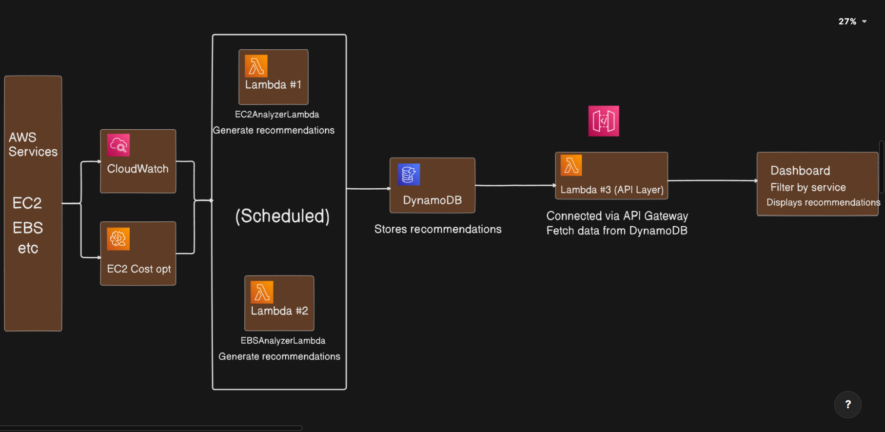
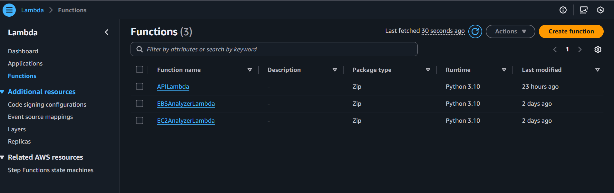

<div align="center">
    
    
    
    
    
    
    
    
</div>

--- 
# **AWS Cost Optimization Tool 💰**
An intelligent, automated AWS cost optimization solution that identifies underutilized resources, provides actionable recommendations, and offers automated remediation capabilities.
## **📋 Project Overview**
This project implements a comprehensive AWS cost optimization system that helps organizations reduce cloud spending by identifying and addressing resource inefficiencies. The solution analyzes EC2 instances and EBS volumes, providing real-time recommendations through an intuitive dashboard.

## **🌚 Key Features**
- **Automated Resource Analysis:** Continuously monitors EC2 instances and EBS volumes for optimization opportunities
- **Intelligent Recommendations:** Identifies idle instances, unattached volumes, outdated storage types, and more
- **Interactive Dashboard:** React.js-based web interface for viewing and managing recommendations
- **Automation:** Automated actions to implement cost-saving measures
Real-time Monitoring: Integration with CloudWatch for performance metrics

## **Architecture Components**
- **AWS Lambda**: Serverless functions for resource analysis and API endpoints
- **Amazon DynamoDB:** NoSQL database for storing recommendations and metadata
- **Amazon API Gateway:** RESTful API layer for dashboard communication
React.js Dashboard: Modern web interface for recommendation management
- **AWS CloudWatch:** Metrics collection and monitoring

## **🏗️ System Architecture**


## **🚀 Quick Start Guide**

### **Prerequisites**
- AWS Account
- Basic knowledege of Lambda, DynamoDB, API Gateway, AWS CloudWatch

### **Step 1: Create Roles**
- why to create role? -> because our Lambda function will access other AWS services like EC2, EBS, DynamoDB etc. so for that reason we are creating role and attache it to Lambda Function
- Create a Role named `cost_optimization_role`
    - Attach policy to it `AmazonDynamoDBFullAccess`, `AmazonEC2ReadOnlyAccess`, `CloudWatchReadOnlyAccess` these are AWS managed policy
    - Create a inline policy `ec2_optimizer`
         ```sh
            {
                "Version": "2012-10-17",
                "Statement": [
                    {
                        "Effect": "Allow",
                        "Action": [
                            "compute-optimizer:GetEC2InstanceRecommendations"
                        ],
                        "Resource": "*"
                    }
                ]
            }
          ```
- create role
- Create Role named `
apilambda-role`
    - Attach policy to it `AmazonDynamoDBFullAccess`
    - Create a inline policy `resource_delete_role_api`
        ```sh
        {
            "Version": "2012-10-17",
            "Statement": [
                {
                    "Effect": "Allow",
                    "Action": [
                        "ec2:StopInstances",
                        "ec2:TerminateInstances",
                        "ec2:DeleteVolume",
                        "ec2:DeleteSnapshot"
                    ],
                    "Resource": "*"
                }
            ]
        }
        ```
- create role
- Now we have our required policies.

### **Step 2: Create DynamoDB Table**
- Table name `CostOptimization`(String)
- Partition key `ResourceId` (String)
- Sort key `Issue`
- Create table

### **Step 3: Create Lambda Functions**

#### **EC2AnalyzerLambda**
- create a Lambda Function named `EC2AnalyzerLambda`
- Choose `Author from scratch`
- Runtime `Python 3.10`
- In `Change default execution role`
    - Use Existing role and add `cost_optimization_role`
- create function
- In Code tab copy past code and hit `Deploy` 

#### **EBSAnalyzerLambda**
- create a Lambda Function named `EBSAnalyzerLambda`
- Choose `Author from scratch`
- Runtime `Python 3.10`
- In `Change default execution role`
    - Use Existing role and add `cost_optimization_role`
- create function
- In Code tab copy past code and hit `Deploy` 
#### **EBSAnalyzerLambda**
- Create Lambda Function named `	
APILambda`
- Choose `Author from scratch`
- Runtime `Python 3.10`
- In `Change default execution role`
    - Use Existing role and add `apilambda-role`
- create function
- In Code tab copy past code and hit `Deploy`

### **Step 4: Create API Gateway**
- Create `API` choose `REST API` (not Private)
- name `
ResourceAnalyzerAPI`
- Hit create
- `Create Resource` resource name = `recommendations`
    - `create method` method-type = `GET`
    - Integration type = `LAMBDA`
    - check `Lambda proxy integration`
    - Choose lambda function `APILambda`
    - `Deploy API` create new stage `dev` or if already exists choose `dev`
    - hit deploy
- `Create Resource` resource name = `update-status`
    - `create method` method-type = `POST`
    - Integration type = `LAMBDA`
    - check `Lambda proxy integration`
    - Choose lambda function `APILambda`
    - `Deploy API` create new stage `dev` or if already exists choose `dev`
    - hit deploy
- `Create Resource` resource name = `action`
    - `create method` method-type = `POST`
    - Integration type = `LAMBDA`
    - check `Lambda proxy integration`
    - Choose lambda function `APILambda`
    - `Deploy API` create new stage `dev` or if already exists choose `dev`
    - hit deploy

### **Step 4: Create EventBridge to Schedule Lambda**
- Create Rule
- name `EC2AnalyzerLambdaSchedular`
- use `Schedule` hit `continue to create rule`
- cron `cron(30 18 * * ? *)` so this will run every day at 12AM
- Choose `AWS Service` select target `Lambda` and select `EC2AnalyzerLambda` fuction
- and create rule
- Similarly create a `EBSAnalyzerLambdaSchedular`
- keep all things same just change target Lambda fucntion to `EBSAnalyzerLambda`

> **Note:** Now we have done setting up all necessary AWS Services. Next move towards setting Dashboard go to `Frontend` folder to view setup

## **📈 Expected Results**
- **EC2 Optimization:** 15-30% reduction in compute costs
- **EBS Optimization:** 10-25% reduction in storage costs
- **Overall:** 20-35% reduction in total AWS bill

## **🤝 Contributing**
- Fork the repository
- Create a feature branch (git checkout -b feature/amazing-feature)
- Commit your changes (git commit -m 'Add amazing feature')
- Push to the branch (git push origin feature/amazing-feature)
- Open a Pull Request

## **🖼️ Screenshots**




## **Built with ❤️ for AWS cost optimization**